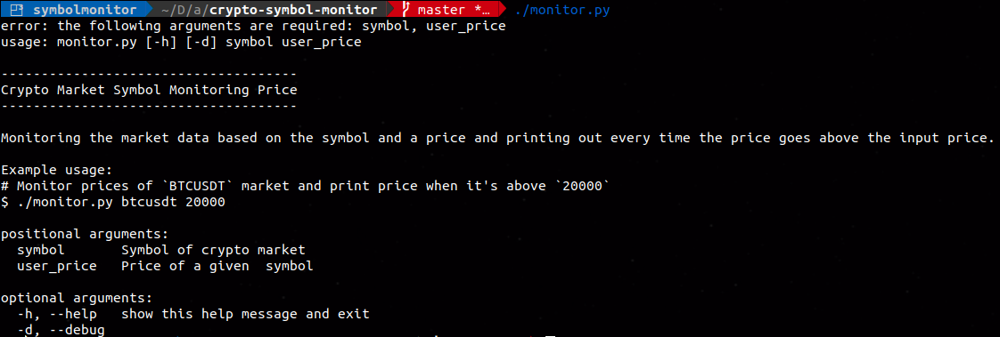
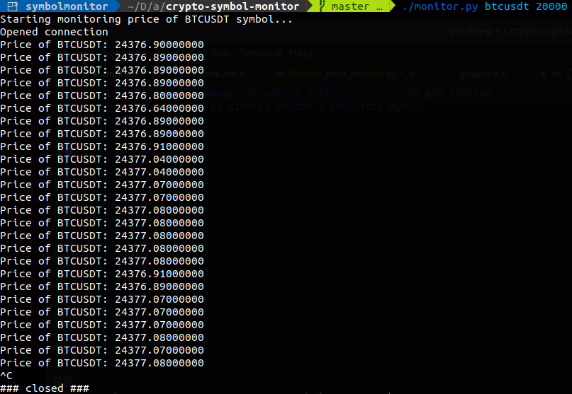

# Crypto Market Symbol Monitoring Price


Monitoring the market data based on the symbol and a price and printing out every time the price goes above the input price.

### Example usage
-------------------
## Ran without positional args:
```
$ ./monitor.py
```


## Ran with positional args:
*Monitor prices of `BTCUSDT` market and print price when it's above `20000`*

```
$ ./monitor.py btcusdt 20000
```



# Technologies
- Python 3.7.8
- The current dependencies are listed [here](requirements.txt)

# Changelog
- Added verification of provided exchange symbol.
- Implemented reconnect websocket server connection after 23 hours.
- Added **```--debug```** mode as optional *`parseargs`*
- Implemented logs logging
    - Formatting logs based on the *`debug`* flag
    - Different color formatting for log types
